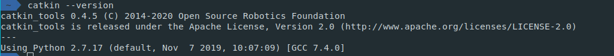
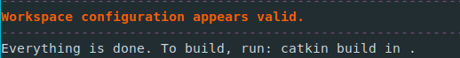
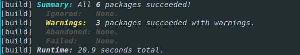
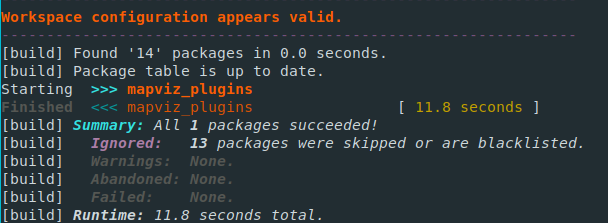
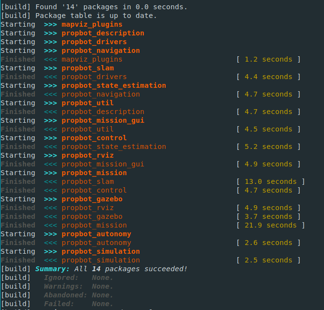

# Getting Started

---

## Table of Contents

- [ROS Installation and Workspace Setup](#ros-installation-and-workspace-setup)
  * [Installing ROS Melodic](#installing-ros-melodic)
      - [A note on catkin](#a-note-on-catkin)
  * [Create the workspaces](#create-the-workspaces)
    + [Cartographer workspace](#cartographer-workspace)
    + [Propbot workspace](#propbot-workspace)
  * [Build an Optimized Google Cartographer for ROS](#build-an-optimized-google-cartographer-for-ros)
    + [Run the custom Cartographer setup script](#run-the-custom-cartographer-setup-script)
    + [Build the Cartographer workspace](#build-the-cartographer-workspace)
  * [Setup the Propbot Workspace](#setup-the-propbot-workspace)
    + [Make Propbot an extension of Cartographer](#make-propbot-an-extension-of-cartographer)
    + [Install dependencies](#install-dependencies)
      - [A note on rosdep](#a-note-on-rosdep)
    + [Build the mapviz plugins](#build-the-mapviz-plugins)
    + [Build the workspace](#build-the-workspace)

<small><i><a href='http://ecotrust-canada.github.io/markdown-toc/'>Table of contents generated with markdown-toc</a></i></small>

---

## ROS Installation and Workspace Setup

The following goes over how to install ROS and setup the catkin workspaces

### Installing ROS Melodic

Follow the instructions here to install the `melodic` version of ROS: http://wiki.ros.org/melodic/Installation/Ubuntu

Ensure that you install the **Desktop-Full Install** version.

##### A note on catkin

Documentation: http://wiki.ros.org/catkin

`catkin` is the build system used for ROS. ROS comes with `catkin`. After doing the installation of ROS, run the following command:

```bash
catkin --version
```

You should see an output similar to this:



If you do not, there may have been an issue installing catkin. To resolve this, run the following command and try the version check command again:

```bash
sudo apt-get install ros-kinetic-catkin python-catkin-tools
```

### Create the workspaces

#### Cartographer workspace

In your home directory, make the cartographer workspace directory

```bash
cd ~/
mkdir cartographer_ws
```

#### Propbot workspace

In your home directory, make the `propbot` workspace directory

```bash
cd ~/
mkdir propbot_ws
```

Then, make the `src` directory and clone the Propbot repo into the new `src` directory.

```bash
cd ~/propbot_ws
mkdir src
cd src
git clone https://github.com/hannahvsawiuk/PropBot.git
```

### Build an Optimized Google Cartographer for ROS

Now that ROS has been installed, we need to start by building Google Cartographer for our application. Cartographer is a system that provides real-time simultaneous localization and mapping (SLAM) in 2D and 3D across multiple platforms and sensor configurations.

**Cartographer documentation:**

- General information: https://google-cartographer.readthedocs.io/en/latest/
- Integration with ROS: https://google-cartographer-ros.readthedocs.io/en/latest/

#### Run the custom Cartographer setup script

The script to setup the custom version of Cartographer is in `vehicle_autonomy/scripts`. To run the setup for the `cartographer_ws`, run the following command:

```bash
~/propbot_ws/src/PropBot/vehicle_autonomy/scripts/setup_cartographer_build.sh ~/cartographer_ws
```

If everything runs smoothly, you should see the following when the process finishes



#### Build the Cartographer workspace

Run the following to initialize and build the workspace

```bash
cd ~/cartographer_ws
catkin build
```

This will take some time (up to **30 minutes**), so please be patient. If the build succeeds, you should see the following statements:



### Setup the Propbot Workspace

Now that the custom Cartographer version has been built, it will be extended with the Propbot packages.

#### Make Propbot an extension of Cartographer

To initialize the workspace and indicate that `propbot_ws` will be an extension of `cartographer_ws`, run the following commands

```bash
cd ~/propbot_ws
catkin init
catkin config --extend ../cartographer_ws/devel
```

The `--extend` argument explicitly sets the workspace you want to extend. In this case, we want the packages in propbot to extend the custom cartographer setup.

For more information on `catkin config`, see here: https://catkin-tools.readthedocs.io/en/latest/verbs/catkin_config.html

#### Install dependencies

To ensure that everything runs smoothly, the dependencies specified by the Propbot packages need to be installed. To accomplish this, run the following:

**Ubuntu**

```bash
cd ~/propbot_ws
rosdep install --from-paths src --ignore-src
```

**Alternative Distros**
If you are not using Ubuntu, the `--os` argument is needed, e.g. `--os=ubuntu:bionic`:

```bash
cd ~/propbot_ws
rosdep install --os=<distro info> --from-paths src --ignore-src
```

##### A note on rosdep

`rosdep` is a dependency manager for ROS that helps you install external dependencies in an OS-independent manner.

**`rosdep` documentation:**

- Wiki: http://wiki.ros.org/rosdep
- Command reference: https://docs.ros.org/independent/api/rosdep/html/commands.html

#### Build the mapviz plugins

Prior to building the entire `propbot_ws`, the mapviz plugs need to be built. Run the following

```bash
catkin build mapviz_plugins
```

If successful, you should see the following



#### Build the workspace

Finally, build the entire `propbot_ws`:

```bash
cd ~/propbot_ws
catkin build
```

Ensure that all packages have been successfully built. You should see the following if the build was completed



Now your `propbot_ws` directory should have the following structure

```
├── build/          # Build space
├── devel/          # Devel space
├── logs/           # Logs space
└── src/            # Source space
    └── Propbot/    # Propbot packages

```

For more information on catkin workspace mechanics, see here: https://catkin-tools.readthedocs.io/en/latest/mechanics.html

