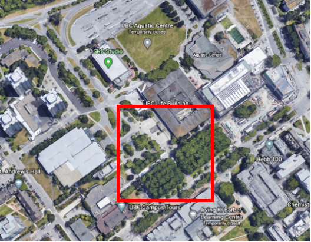
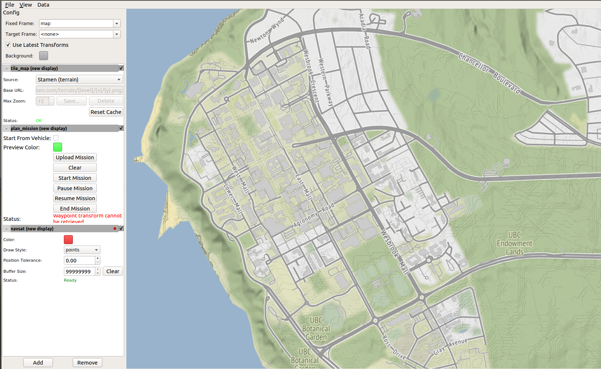
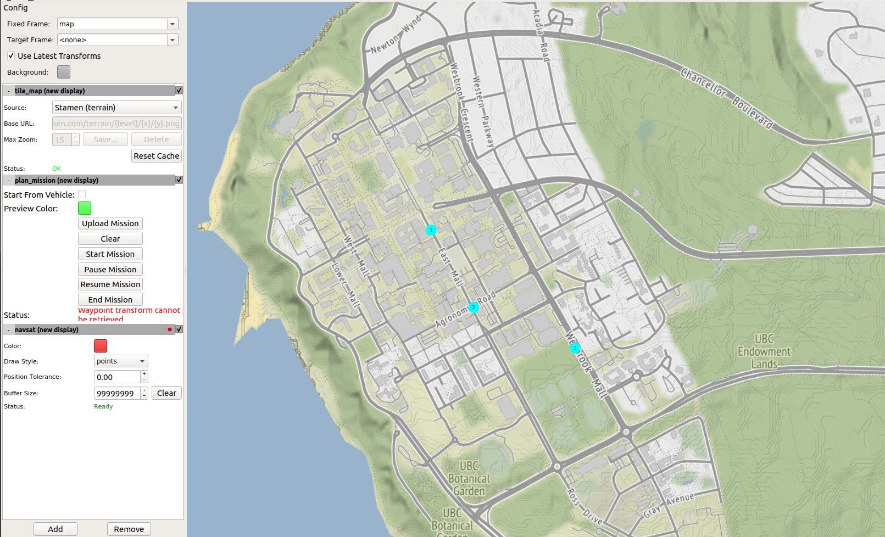

# Mission Execution

These instructions describe how to set-up and run an autonomous waypoint mission using Propbot. If you are not executing the mission in simulation, skip the instructions for _Setting up the simulation computer_. 


## Setting up communication between multiple machines

In order to set up the mission command centre to communicate with the vehicle autonomy computer, perform the following steps:

1. Make sure both the mission command centre computer and vehicle autonomy computer are on the same network. Do a simple ping test to 
make sure they can communicate with each other.
2. On the vehicle autonomy computer, run: `export ROS_MASTER_URI=http://vehicle_autonomy_computer:11311`.
3. On the vehicle autonomy computer, run: `roscore`.
4. On the mission command centre computer, run: `export ROS_MASTER_URI=http://vehicle_autonomy_computer:11311`.

Make sure the export command is either in run in every terminal used.

Repeat steps all of the above steps to set up communication between the simulation computer and vehicle autonomy computer. 

## Setting up the simulation computer

On the simulation computer, build all of the packages inside the _simulation_ directory.

```bash
catkin build  propbot_gazebo  propbot_rviz  propbot_simulation
```

The following commands will a launch simulation environment that is modeled off of this area on UBC campus.

 

If you would like use a static simulation environment launch the following file:
```bash
roslaunch propbot_simulation ubc_student_union_sim.launch
```

If you would like to use a dynamic simulation environment launch this file instead of the one above:
```bash
roslaunch propbot_simulation ubc_student_union_sim_people.launch
```
## Setting up the vehicle autonomy computer


Build all of the packages inside the _vehicle_autonomy_ and _common_ directory:


```bash
catkin build propbot_autonomy  propbot_control  propbot_description  propbot_drivers  propbot_mission  propbot_navigation  propbot_slam  propbot_state_estimation propbot_common_msgs  propbot_util
```
Launch the autonomy stack:
```bash
roslaunch propbot_autonomy autonomy.launch
```


## Setting up the mission command centre

Build all of the packages inside the _mission_command_centre_ and _common_ directory:

```bash
catkin build  mapviz_plugins  propbot_mission_gui propbot_common_msgs  propbot_util
```

Launch the mission command centre GUI:
```bash
roslaunch propbot_mission_gui mapviz.launch
```

 

The above shows the default GUI configuration. If you would like to display satellite map tiles follow the instructions from this repository

**ROS Offline Google Maps for MapViz:** https://github.com/danielsnider/MapViz-Tile-Map-Google-Maps-Satellite


### Executing the mission

Configure and command a mission using the _plan_mission_ section of the control panel:
1. Select mission waypoints by clicking on the map and clear them as you like by selecting _Clear_
2. Once you are satisfied with your mission configuration, upload the mission to propbot by selecting _Upload Mission_
3. Start the mission by selecting _Start Mission_
4. You may pause, resume, or end the mission at anytime by selecting _Pause Mission_, _Resume Mission_, and _End Mission_
5. Monitor the robots progress on the display 

**Note**: You must wait until a mission is finished or end the mission before uploading a new one


 

