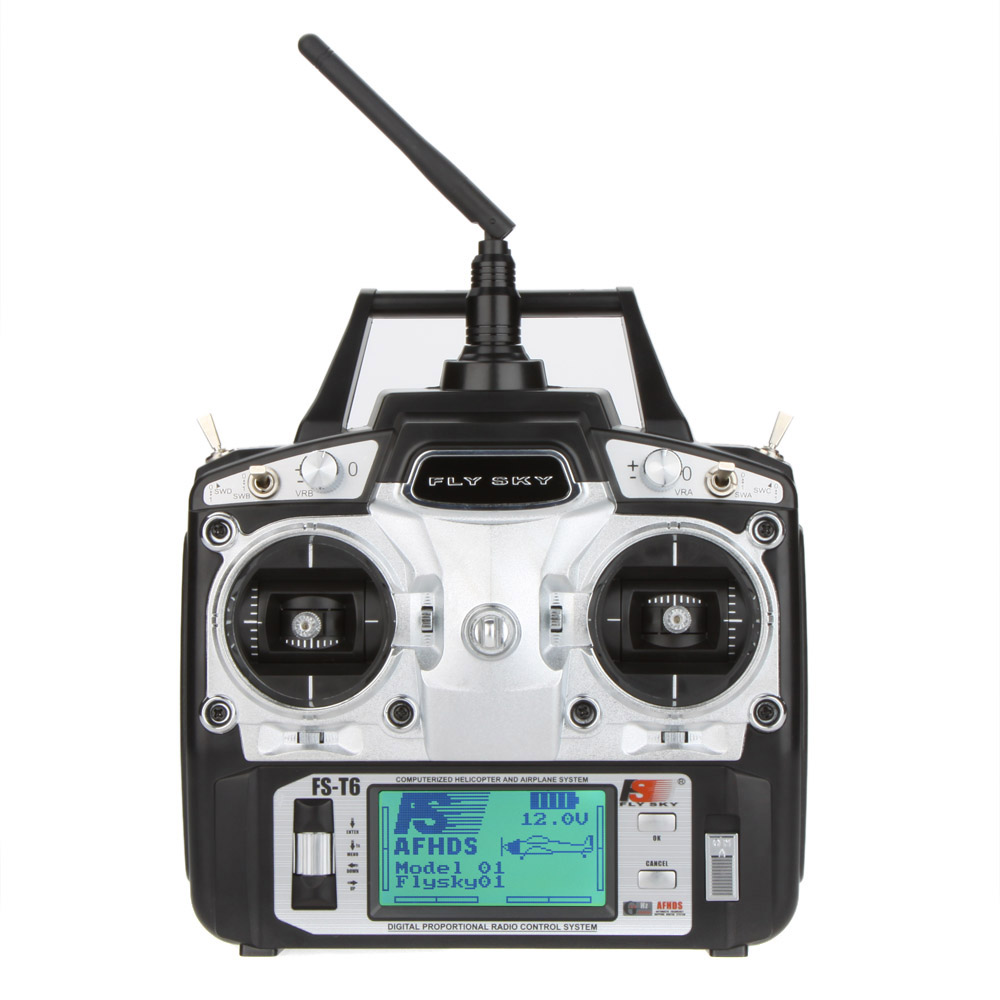
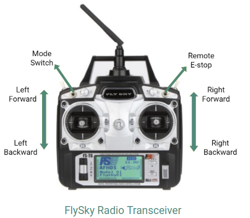

# RC User Guide

---

The FS-T6is a six-channel transmitter with two joysticks and four programmable switches. This provides a joystick foreach set of wheels and programmable switches for a remote kill switch and a autonomy to manual mode switch. The figure below demonstrates how the four functions mentioned above are distributed on the transmitter. The remote controller receiver is FS-R6B, which is a six-channel receiver.

## Command Overview

### Movement Joysticks

The right and left joysticks control the right and left longitudinal sets of 
robot wheels, respectively. The user can choose between linear and non-linear speed mapping within the firmware to achieve varying speed resolutions.

The maximum speed of a robot can also be clamped by altering the maximum duty threshold in the firmware.

### Mode Switch: Switch B

When switch B is high, the mode is set to `autonomy` in which the autonomy
computer can control the robot's movement. The low position indicates manual 
mode.The switch works asynchronously and so the mode can be switched at any time.

### Remote E-Stop: Switch A

Switch A controls the remote e-stopping functionality. When switch A is in the high position, the vehicle interface will send 0 speed commands and inputs from the movement joysticks are blocked. Once de-asserted, the speed commands
return to following the movement joysticks.