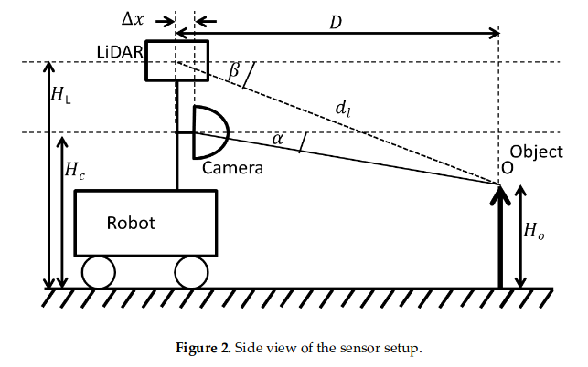
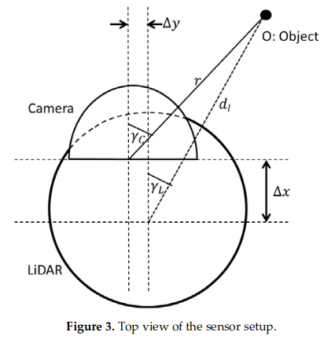
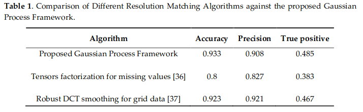
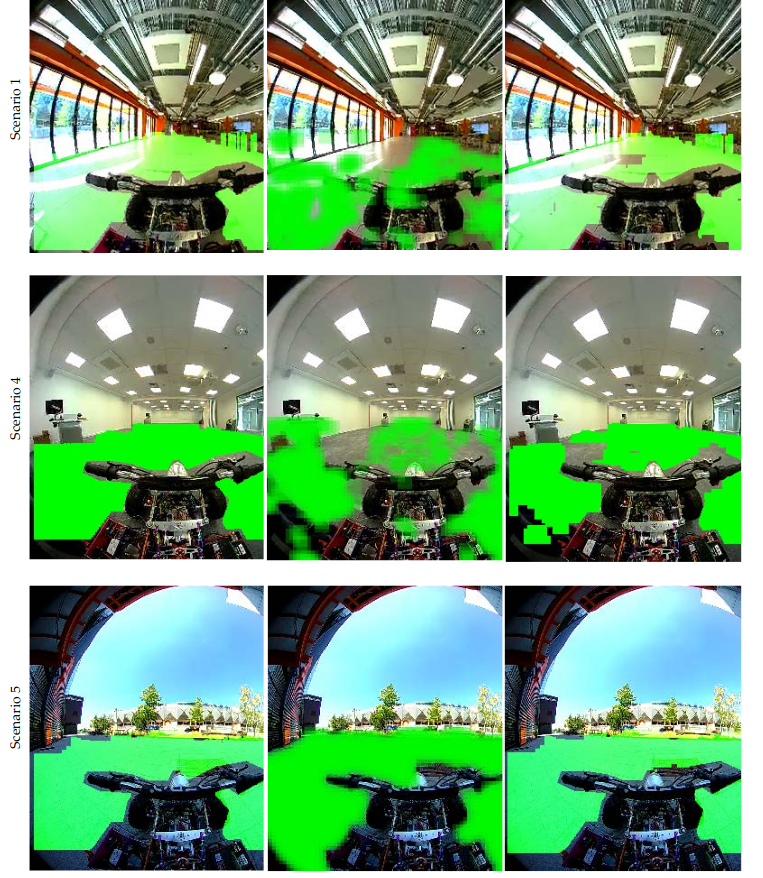
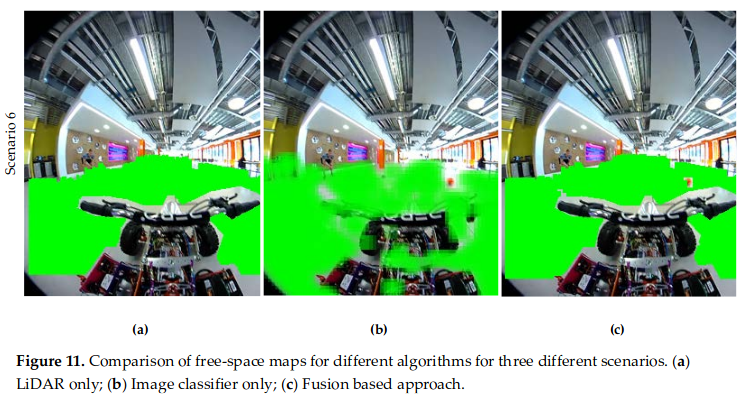

# Lidar and Camera Fusion Algorithms

## Geometric Alignment of LiDAR and Camera Data
* Geometrically align the data points of the LiDAR output and camera to find the corresponding pixel in the camera output for each data point output by the LiDAR sensor

    
    
    
## Resolution matching
* this is necessary as the image resolution will be much greater than the LiDAR output
* also helps to compensate for discrepancies or errors in the geometric alignment step
* the objective is to fill the missing values in the depth map
    
    

## Free space detection experiment (FSD)
* image based FSD can be a supervised FSD that learns FS from examples
* LiDAR-based FSD algorithm can be achieved using Occupancy Grid Maps
* the figure below shows the results from the comparisons of the Different Algorithms for FSD
    * Scenario 1 corresponds to a situation where the image based FSD is not performing very well; in this example, due to high saturation and mirroring on the floor,  the  area  just  next  to  the  glass  windows  is  not  classified  as  free  space  (i.e.,  the classifier fails). However, the LiDAR information in this region shows high confidence and hence the fused image combines the two areas based on uncertainty
    * in scenario 6, a ball is thrown across the vehicle and falls on the LiDAR's blind spot but results are captured by the the image-based FSD

    
    

## Limitations
* uncertainty can by caused by the movement and vibration of the platform which will accumulate over time
* video quality can become poor while the vehicle is in motion

    
 