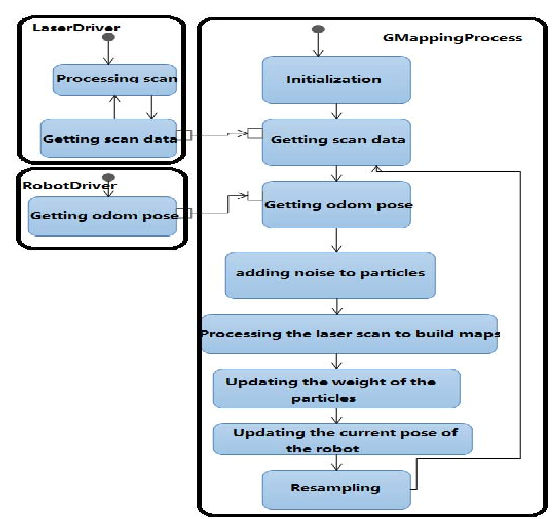
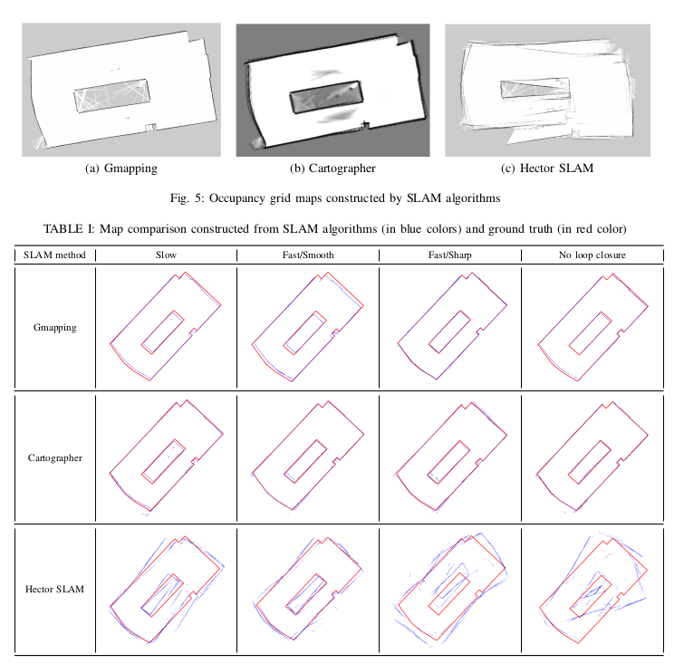
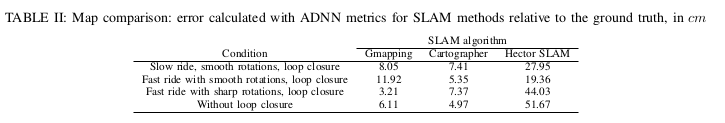

# Lidar SLAM Algorithms
## GMapping

### Overview
* uses a Rao-Blackwellized particle filter which re-samples areas adaptively (eliminates a large number of particles from the sample set during resampling)
* computes accurate robot localization by integrating most recent sensor observations with odometry robot motion model 
* algorithm

### Hardware Requirements
* odometer
* horizontally mounted, fixed, laser range finder
* optimized for long-range laser scanners like SICK LMS or PLS scanner (2D)

### Software Requirements
* [GROS repository](https://github.com/ros-perception/slam_gmapping)
* Linux/Unix
* GCC 3.3/4.0.x
* CARMEN (latest version)
Quick Install-Guide using bash: ./configure; . ./setlibpath; make; 

## Google Cartographer

### Overview
* provides SLAM in 2D and 3D across multiple platforms and sensor configurations
* pose estimation to reduce error accumulation during long iterations
* algorithm
    *

### Hardware Requirements
* 64-bit, modern CPU (e.g. 3rd generation i7
* 16 GB RAM
* Lidar
* IMU sensor (linear acceleration, Angular velocity) -  needed for 3D SLAM 
* odometer or GPS

### Software Requirements
* [ROS Respository](https://github.com/googlecartographer/cartographer_ros)
* Ubuntu 14.04 (Trusty) and 16.04 (Xenial)
* gcc version 4.8.4 and 5.4.0

## Hector SLAM

### Overview
* 2D SLAM system which combines lidar scan matching and 3D navigation approach with inertial sensing system by Extended Kalman Filter(EFK)
* alignment of laser beam endpoints with a map obtained is provided by Gaussian Newton optimization approach
* scan matching is implicitly performed with all preceding scans
* utilizes only Lidar data

## Comparison
* an experiment was carried out on a mobile platform equipped with 
    * Jetson TX1
    * bumpers
    * sonars
    * Troyka IMU module
    * Hokuyo urg-04lx-ug01 2D lidar
    * Velodyne VLP-16 3D Lidar
    * wheel encoders that allow to calculate the wheel odometry 
* "ground truth map" was constructed with a separate laser tracker 

## Summary

* google cartographer constructed the map with the smallest error in almost all test scenrios
