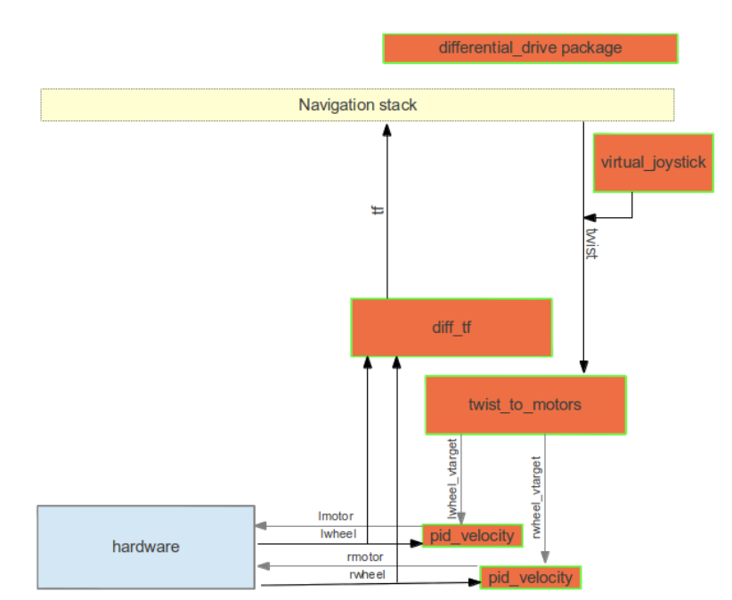
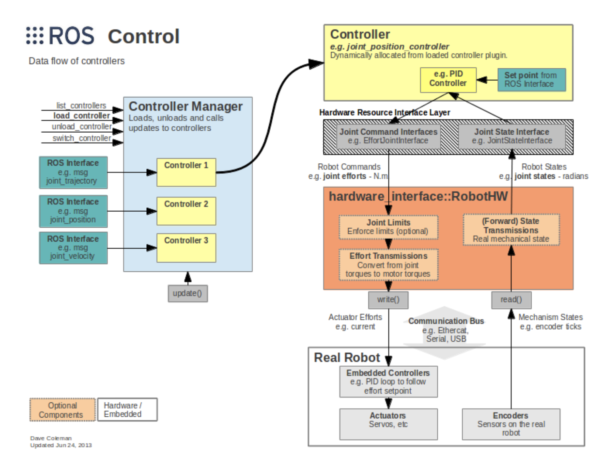

# Control Research

`Propbot is a 4 wheeled differential drive robot, and we need to design a controller for it (or use something off of the shelf)`

## Off of the shelf Robot Controllers and Autopilots

Requirements of controlling at least 4 axes, IMU integration, GPS/INS integration, and support for CAN or RS232 communication. All the requirements decreased the options available:

[Pixhawk 4](https://docs.px4.io/v1.9.0/en/flight_controller/pixhawk4.html)
[Hex Cube flight controller](https://docs.px4.io/v1.9.0/en/flight_controller/pixhawk-2.html)
[CUAV V5+ Autopilot](https://docs.px4.io/v1.9.0/en/flight_controller/cuav_v5_plus.html)
[NAVIO2](https://emlid.com/navio/)

```After looking into the controller options, the top two would be the Pixhawk4 or the NAVIO2.```
```However, it seems that these systems are too complicated for a simple differential drive system. The firmware is difficult to modify and there is a lot of additional functionality that we don't need, as our autonomy computer will be handling waypoint navigation and trajectory generation.```

## ROS Differential Drive Control Packages

A lot of projects just use an Arduino or microcontroller to control the robot with a separate computer that runs ROS. There are two readily available differential drive packages on ROS that use encoder readings and velocity commands to do closed loop control.

### Differential Drive
[differential_drive](http://wiki.ros.org/differential_drive)

- This package takes has the following nodes:
  - diff_tf - Provides the base_link transform.
  - pid_velocity - A basic PID controller with a velocity target.
  - twist_to_motors - Translates a twist to two motor velocity targets
  - virtual_joystick - A small GUI to control the robot. (```This is useful for initial testing purposes```)
- Pros: Easy to integrate, publishes odometry, robot-independent, basic PID controller, has jerk limits
- Cons: Not being maintained, not available for ROS melodic (```This will likely mean we can't use it, we should stick to packages that are well maintained and available for melodic, OR we will have to rework this package in melodic, which should be quite simple.```)

### Diff Drive Controller
[diff_drive_controller](http://wiki.ros.org/diff_drive_controller)
 - Control is in the form of a velocity command, that is split then sent on the two wheels of a differential drive wheel base. Odometry is computed from the feedback from the hardware, and published.
 - Has built-in jerk, speed, and acceleration limits
 - Can register multiple wheels per side
 - Will have to create a velocity interface
 - Pros: Built on ROS's control platform, well maintained, in C++, suitable for real-time applications(```This sets the robot up much better when it needs to operate in higher speed environments```)
 - Cons: More difficult to setup (said not to be easy for beginners)

#### Useful resources for help with implementation:
[Husky Robot Hardware Base](https://github.com/husky/husky/blob/kinetic-devel/husky_base/src/husky_base.cpp)
[Husky Robot Launch File with Diff Drive Controller](https://github.com/husky/husky/blob/kinetic-devel/husky_base/launch/base.launch)
[Sample Hardware Interface](https://github.com/eborghi10/my_ROS_mobile_robot/blob/e04acfd3e7eb4584ba0aab8a969a74d6c30eed34/my_robot_base/include/my_robot_hw_interface.h#L184)
[Setting up diff drive control with Gazebo](https://answers.ros.org/question/277415/use-of-diff_drive_controller-to-simulate-a-differential-drive-in-gazebo/)
[Configuration Tutorial](https://www.theconstructsim.com/ros-qa-126-how-to-configure-the-differential-drive-ros-controller/)


This package is based on (ros_control)[http://wiki.ros.org/ros_control] which is pictured below:



### Existing Projects
[Navigation of a Pioneer 3-AT Differential Drive Robot](https://sites.google.com/site/slamnavigation/)