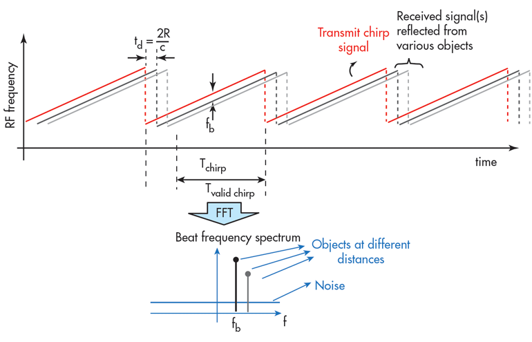

# Radar Application Feasible Analysis and Options

## Introduction to Radar

Radar was first developed in 1904 by German inventor Christian Huelsmeyer. An early implementation of radar technology could detect ships up to 3000 m away. The device used a directional spark-gap transmitter operating at a wavelength of 40-50 cm and separate receiver antenna. The initial design indicated only the presence of a target object, but later versions could determine range using a simple geometrical calculation.

### Principles of FMCW Radars

The broadband Frequency Modulated Continuous Wave (FMCW) radar has become the dominant technology for automotive use because it combines high resolution in range and depth perception, with the detection of objects like pedestrians and bicycles in a small radar cross-section.

In an FMCW radar, both transmitter and receiver operate continuously; the transmitter deploys a sinusoidal carrier with a frequency that increases then decreases periodically over time- a sequence known as a chirp.

## Sources

 - [ECN Magazine](https://www.ecnmag.com/article/2017/12/radar-technology-behind-autonomous-vehicles)
