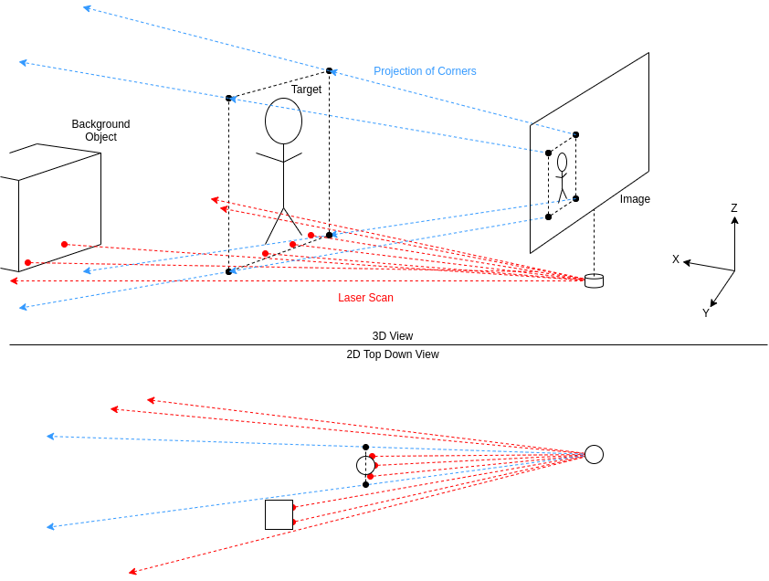

# Propbot Object Detection

## Overview

This package provides object/dynamic obstacle detection using the YOLO object detection system.

See [https://pjreddie.com/darknet/yolo/](https://pjreddie.com/darknet/yolo) for how it works.


As seen above a person is detected on the camera and 3D bounding box (green) is placed around them.

The package intakes camera data and then outputs detection of objects in 2D as an overlay
over the camera.  It also estimates the location of the bounding box in 3D using laser
scan data and outputs a cylindrical marker for visualization in rviz.

Future Improvements:
- Tracking of dynamic obstacles with speed and future path estimation
- Integration with social navigation layers in costmap 2D

## System Design


### Packages

**Devices:**

- Camera: Realsense or Kinect
- Velodyne VLP-16: LiDAR

**Third Party Packages:**

- [darknet\_ros](https://github.com/leggedrobotics/darknet_ros): Integrates 
  [Darknet/YOLO](https://github.com/jackguo380/darknet) with ROS,
  [forked](https://github.com/jackguo380/darknet_ros) to fix some OpenCV issues
- pointcloud\_to\_laserscan: Standard ROS package, does what it says...

**Propbot Packages:**
- publish\_people: the node written as a part of this package to calculate 3D bounding boxes

### Data Flow

Starting from the top-left, the camera outputs images and its camera information.
The primary receiver of this of this are the `darknet_ros` and `publish_people`.

Upon receipt of the image `darknet_ros` will do the actual detection producing the bounding
boxes. Internally `darknet_ros` also uses OpenCV to overlay the bounding boxes onto the image
this gets published as the detection image which can be viewed in rviz.

The bounding boxes published by `darknet_ros` are in 2D in pixel coordinates. This is where 
`publish_people` comes in, this is a custom node which receives the bounding boxes and
estimates their actual position in 3D space. In order to do this the node needs some 3D
information such as depths.

As a part of the rest of the autonomy stack, the LiDAR scan from the Velodyne VLP-16 is
already converted to a laser scan which is used by `publish_people`. An alternative is
to use the point cloud directly, however this requires much more processing power as
well as a more complex algorithm for filtering out the ground or background.

After `publish_people` figures out the bounding box's 3D position it publishes some
rviz markers so they can be visualized. Ideally `publish_people` should also publish
`people_msgs/People` as well but this has not been implemented yet.


### Some Math

`publish_people` uses some moderately complex geometry math to estimate the bounding
boxes. It mainly involves some knowledge of linear algebra and some computer graphics.

In computer graphics a commonly used model is the pinhole camera model. It is often
used to project 3D objects onto a 2D plane to render a image from 3D models. In our
case we have a 2D image and want then in 3D so the reverse must occur. To do this we
can create a ray from each of the 4 corners of the bounding box. The math behind this
can be a bit complex, but fortunately the `image_geometry` package already implements
it. The `PinholeCameraModel` class provides a method to convert a pixel coordinate to
a ray.

```cpp
class PinholeCameraModel {
  // ...
  cv::Point3d projectPixelTo3dRay(const cv::Point2d& uv_rect) const;
}
```

Now that we have the rays we know the general direction of the bounding box in 3D
but not how far it actually is. This is where the laser scan comes in, the scan
provides a bunch of depth measurements regular angles around the robot. Since we
have the rays we can figure out what angles these rays are at to find left and
right angles to search between. 

Before finding the angles we first need to transform from the camera's frame to
the laser frame. Transforming the ray as a direction is somewhat complicated, its
much easier to transform a point. However a problem arises in that the camera and
laser don't share the same origin. The issue is that if you translates a point
from the camera frame to the laser frame, the angle of the ray is different.


To fix this issue we extend the ray out to "infinity" or in other words a large
distance like 1000 meters away (by multiplying it). From doing this, the error
introduced from translating the point between frames is reduced to a negligible
amount. Imperfections in the camera, LiDAR, etc add random error anyways so this
is acceptable.

Now that the "rays" represented by points are in laser space we can find the
angle between each ray and the XZ plane (X = forward, Z = up). As it turns out
the upper and lower rays on each side produce the same angle (Unless some non-sane
person mounted your camera tilted). Therefore we end up with 2 angles for the left
and right of the bounding box. Now its simple a matter of searching for the depth
values from the laser scan which are between these angles.

An issue that arises after finding the depth values is that the bounding box is not
tight so some background objects may be detected as well. Currently the package uses
a simple naive algorithm which simply cuts off depths which are far away beyond a
certain distance. A known limitation is that it doesn't work at all when there are
foreground obstructions. I'll leave it up to whoever's next to implement this...

After the depths are determined we can determine the center of the 3D bounding box
as ray in between all 4 corners with the length as the depth. The 2D bounding
box at this point becomes the cross section of the 3D bounding box. Finally, the 3D
box would have a thickness of 2x the max depth - min depth since the laser only
scans the front facing half of a object.

Here's a summary of the math:



